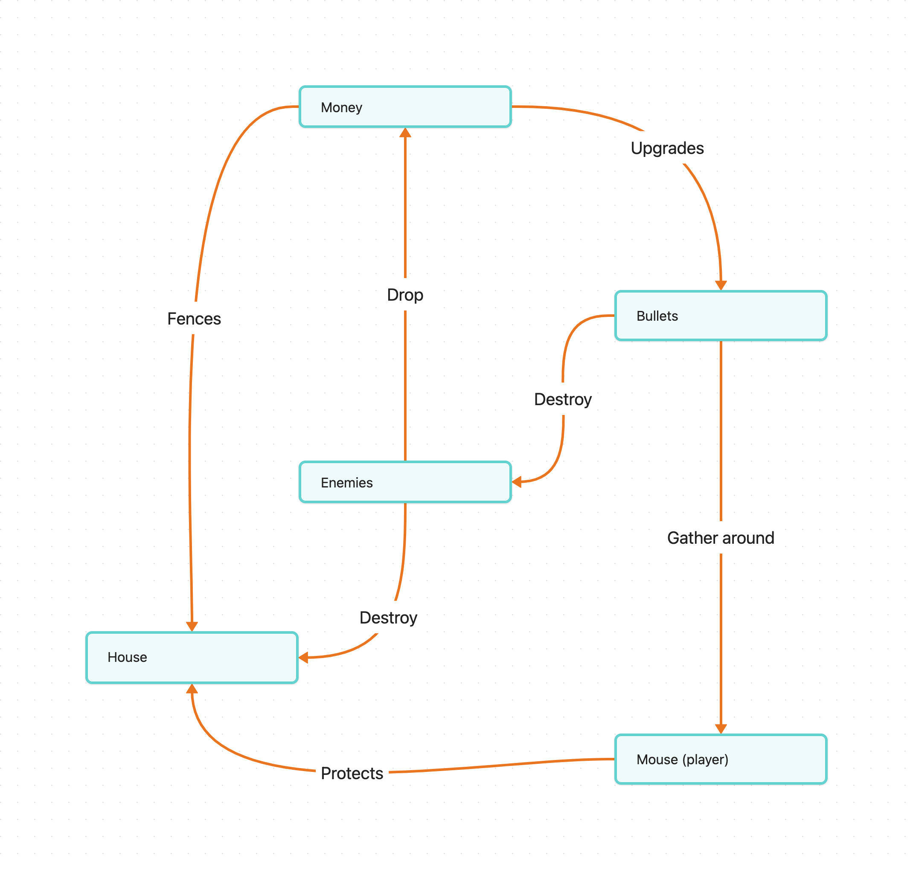

# House Defense Game

This is a game made to prove myselft in making something from start to finish, doing all in my own (sprites, music, code, etc), cause even if they are ugly, i made them and im not gonna sell this anyway. This project is made in c++23 standard, using a stdbridge module to use the c++ std library as a module while waiting for support for `import std`. Plans for the future are to move this to cpp2 to make an example project for inspiring others to use [cppfront](https://github.com/hsutter/cppfront), because it is incredible. Building instructions are [here]( )

### To-do
> THESE ARE QUESTIONS / REMINDERS FOR THE COMMON SUPERMEGAJUNIOR GAME DEVELOPER

- DONE make healthbar for enemies
- fix rotation of player
- autofire
- better maps
- levels defined in json
- port frames file to json
- reestructure code
- make entity factory more generic
- destroy bullets when they are offscreen
- README
- support for windows, right now all is invaded by clang and macos stuff (LLD, bundling and frameworks) 
- should i stick to my_assets or better to more flexibility and add compatibility between specializations of `assets<T>`??
- STATE CLEARLY FOR SYSTEMS PURPOSES AND OWNERSHIP OF RESOURCES
- MORE TESTS FOR LEVEL AND LEVEL MANAGER
- SHOULD I USE POLYLINE FOR ENEMY PATH??
- sfml modules will be removed
- gui should also be a step
- WIP is asset Manager needed??
  - Maybe a 'keepalive' flag for passing ownership or a `Res<T>` wrapper 
- tmx render, use library or do it myself 

## Game flow idea
